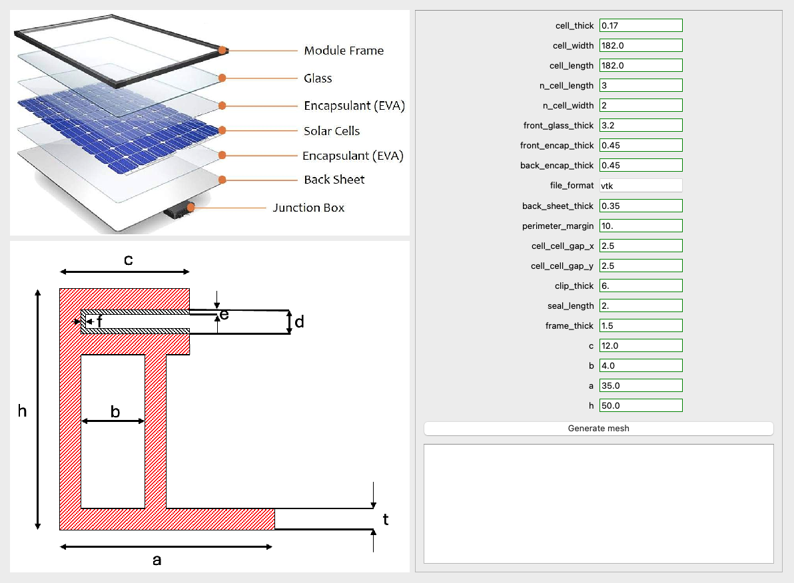

# PVMesh


PVmesh is an opensource software that generate a mesh for photovoltaic panels in multiple formats. 
The geometry of the PV panel can be mofified through a set of variables.
PVmesh can be used through a graphical user interface (GUI) or by modifying a yaml input file.
The GUI has preset values for all variables that control the geometry of the panel. 
Among the file formats that can be generated with PVmesh we have:
- `.msh` for ANSYS 
- `.bdf` for COMSOL 
- `.vtk`for FEnics/FEniCSx 
- `.inp`for ABAQUS 

For more information, visit the [PVMesh Documentation](https://pvmesh.readthedocs.io/en/latest/index.html).

[](https://github.com/NREL/PVMesh/actions/workflows/test_pvmesh.yaml)
[](https://pvmesh.readthedocs.io/en/latest/?badge=latest)


## Getting Started 

PVmesh use primarly [GMSH](https://gmsh.info) as the backend for mesh generation and  [PyQt5](https://www.riverbankcomputing.com/static/Docs/PyQt5/) for the GUI.

Installation of the pre-requisits for PVmesh can be done through conda/mamba using the follwing command

```
mamba env create -n pvmesh -f environment.yaml
```

The environement created can be activated using the command 

``` 
mamba activate pvmesh
```

### PVmesh example

Executing PVmesh can be done through the GUI or using CLI. 
The GUI can be executed by executing

```
python pvmesh/guipytk.py.py 
```

The GUI should appear as a pop-up window. 



The user interface should look like this. 
The two figures demonstrate what the variables controls. 
All variables are preset using the file original.txt.
They can also be modified to obtain the a mesh that meets your dimensions. 
Once the variables are set, you can press the execution button which will write all variables to a new file `input.txt` and execute mesh_generator.py.
The mesh generated will be under the name `panel_geo` with the extension specified in the GUI. 
The available file formats are:
 - `.msh` for ANSYS
 - `.bdf` for COMSOL
 - `.vtk`for FEnics/FEniCSx
 - `.inp`for ABAQUS


PVmesh can also be used through CLI. 
A file containing all variables and their assigned values needs to be created under the name `input.txl`.
This file needs to follow the same structure as `original.txt`. 
The mesh generator can then be executed using 

```
python pvmesh/mesh_generator.py
```


mesh_generator.py is the file that creates the geometry and mesh using GMSH. 
It reads all variables from input.txt (created by the GUI).  
In the case where input.txt is not available, mesh_generator.py will use original.txt to set the variables.

### Creation of multiple meshes 

PVmesh allows the creation of multiple meshes by taking comma separated values. 
For example, if I am conducting a parametric study on the impact of cell_width and require meshes with `cell_width = [3,4,5]`, the variable `cell_width` can take 3,4,5 and will generate 3 input files for each case, then generate a mesh for each file. 
a subdirectory is created for each case containing the input file the `.brep` geometry file and the mesh file.
All variables can take comma seprated values, where the the combinations are sorted and the necessary input files are generated.


## Code structure:  mesh_generator.py

### Variables 

The variables that control the geometry of the panel are the following:

- cell_thick: thickness of cell 
  
- cell_width: width of each cell 
- cell_length: length of each cell 
- n_cell_length: number of cells along x       
- n_cell_width: number of cells along y   
- cell_cell_gap_x: gap between cell along x
- cell_cell_gap_y: gap between cell along y

- front_glass_thick: thickness of gront glass layer
- front_encap_thick: thickness of front encapsulant layer
- back_encap_thick: thickness of back encapsulant layer

- back_sheet_thick: thickness of backsheet or back glass
- perimeter_margin: edge margin
- file_format: format of the generated mesh


- parameters `a`,`b`,`c`,`h` are frame parameters and are shown in the frame illustration in the GUI picture above. 

- clip_thick: open space of frame ( `d`) 
- seal_length: width of seal (distance from panel edge to frame, `f`)
- frame_thick:  thickness of frame (`t`)


### panel mounting

- mesh_size_in_cell
- mesh_size_out_cell
- mounting_area_shape
- mounting_area_size
- mounting_location


### Panel Geometry

Once the variables are defined, the panel geometry is created in steps. 
The panel is decomposed into 7 substructures: frame, back_sheet, back_encap, cell_layer, front_encap, front_glass and cells. 
to finalize the geometry a seal is added to close the gap between the frame and the multilayered panel. 

### Panel mesh 

The geometry created is sorted to obtain 1D, 2D and 3D elements. 
Each substructor is meshed based on its geometry.
Adaptive mesh refinement is used to reduce mesh density where its not needed. 


refrences 

```bash
@misc{duramat,
    key = {duramat},
    note = {https://www.duramat.org/about}
}

@article{hartley2023analyzing,
  title={Analyzing photovoltaic module mechanics using composite plate theories and finite element solutions},
  author={Hartley, James Y and Khraishi, Tariq},
  journal={Journal of Composite Materials},
  volume={57},
  number={22},
  pages={3573--3583},
  year={2023},
  publisher={SAGE Publications Sage UK: London, England}
}

@techreport{he2018finite,
  title={Finite element simulation of mixed-mode PV encapsulant delamination based on cohesive zone model},
  author={He, Xin and Bosco, Nicholas S},
  year={2018},
  institution={National Renewable Energy Lab.(NREL), Golden, CO (United States)}
}

@techreport{deceglie2023whatscracking,
  title={WhatsCracking [SWR-23-03]},
  author={Deceglie, Michael and Bosco, Nicholas and Silverman, Timothy and Springer, Martin},
  year={2023},
  institution={National Renewable Energy Laboratory (NREL), Golden, CO (United States)}
}

@article{young2020fluid,
  title={A fluid-structure interaction solver for investigating torsional galloping in solar-tracking photovoltaic panel arrays},
  author={Young, Ethan and He, Xin and King, Ryan and Corbus, David},
  journal={Journal of Renewable and Sustainable Energy},
  volume={12},
  number={6},
  year={2020},
  publisher={AIP Publishing}
}

@article{bosco2020viscoelastic,
  title={Viscoelastic material characterization and modeling of photovoltaic module packaging materials for direct finite-element method input},
  author={Bosco, Nick and Springer, Martin and He, Xin},
  journal={IEEE Journal of Photovoltaics},
  volume={10},
  number={5},
  pages={1424--1440},
  year={2020},
  publisher={IEEE}
}

@article{manual2012abaqus,
  title={Abaqus 6.11},
  author={Manual, Abaqus Scripting User’s},
  journal={http://130.149},
  volume={89},
  number={2080},
  pages={v6},
  year={2012}
}

@article{manualcomsol62,
  title={COMSOL 6.2},
  author={Reference Manual},
  journal={https://doc.comsol.com/6.2/doc/com.comsol.help.comsol/COMSOL_ReferenceManual.pdf},
  year={2023}
}

@article{manualansys2024,
  title={ANSYS 2024R1},
  author={User Manual},
  journal={ANSYS, Inc.},
  year={2023}
}

@article{geuzaine2009gmsh,
  title={Gmsh: A 3-D finite element mesh generator with built-in pre-and post-processing facilities},
  author={Geuzaine, Christophe and Remacle, Jean-Fran{\c{c}}ois},
  journal={International journal for numerical methods in engineering},
  volume={79},
  number={11},
  pages={1309--1331},
  year={2009},
  publisher={Wiley Online Library}
}
```
